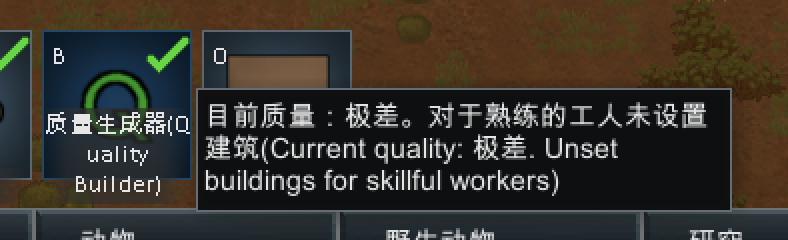

# RimWorld mod 自动机翻脚本

## 简介
这是一个很简单的RimWorld mod机翻脚本，使用的Google翻译。翻译后会保留原文，展示形式为<u>**中文(English)**</u>

## 使用方式
### Windows
1. 下载脚本
    1. 直接点击上方<u>**clone or download**</u>后点击<u>**download zip**</u>
    2. 解压缩
2. 下载安装 Python3
    1. 打开网页 https://www.python.org/downloads/ 
    2. 点击<u>**Download Python 3.x.x**</u>
    3. 下载完成后双击打开
    4. **勾选上Add Python 3.x to PATH**
    5. 点击Install Now
3. 安装依赖
    1. 右键电脑右下角Windows图标点击运行，输入CMD，确定
    2. 在CMD窗口中输入`pip3 install googletrans`
    3. 在CMD窗口中输入`python `注意有空格
    4. 将解压出的文件中的rimworld_translate.py拖入CMD窗口 回车执行
    5. 输入mod文件的上层目录，就是包含所有mod文件夹的目录

## 效果展示

## 常见问题
1. pip3 install后一直没反应，之后出现Timout。答：科学上网
2. 脚本执行后报错“连接尝试失败”。答：科学上线
3. 报错“系统找不到路径”。确认下输入的mod列表路径是否正确